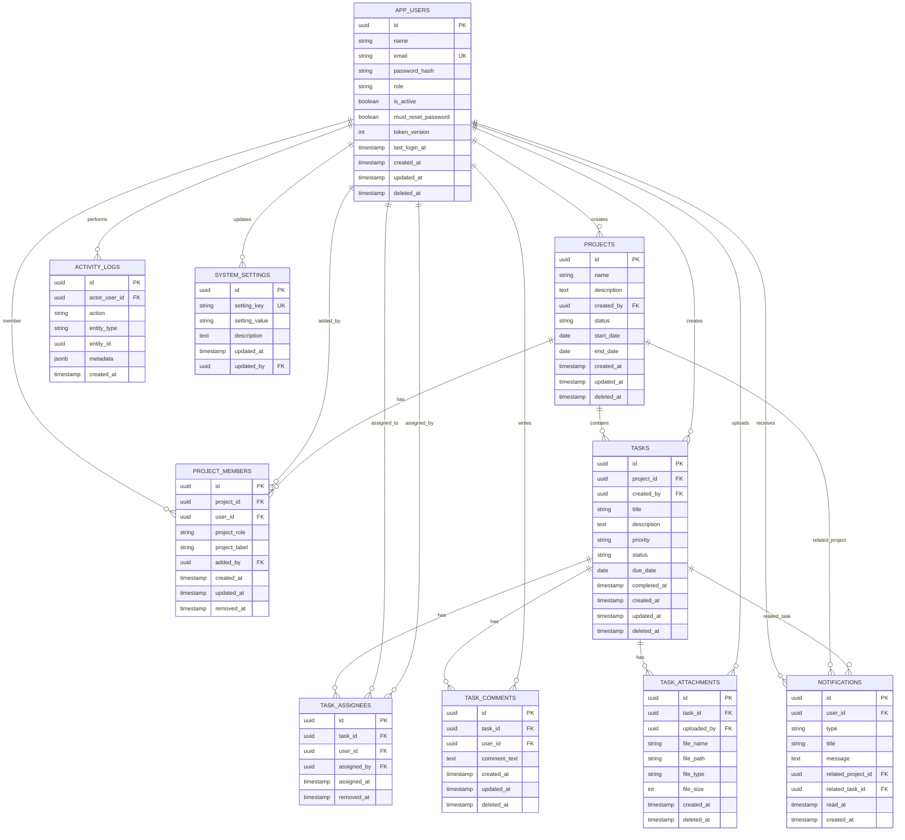

# Veyra Task Management System - ER Diagram

```mermaid
erDiagram
    APP_USERS {
        uuid id PK
        string name
        string email UK
        string password_hash
        string role
        boolean is_active
        boolean must_reset_password
        int token_version
        timestamp last_login_at
        timestamp created_at
        timestamp updated_at
        timestamp deleted_at
    }

    PROJECTS {
        uuid id PK
        string name
        text description
        uuid created_by FK
        string status
        date start_date
        date end_date
        timestamp created_at
        timestamp updated_at
        timestamp deleted_at
    }

    PROJECT_MEMBERS {
        uuid id PK
        uuid project_id FK
        uuid user_id FK
        string project_role
        string project_label
        uuid added_by FK
        timestamp created_at
        timestamp updated_at
        timestamp removed_at
    }

    TASKS {
        uuid id PK
        uuid project_id FK
        uuid created_by FK
        string title
        text description
        string priority
        string status
        date due_date
        timestamp completed_at
        timestamp created_at
        timestamp updated_at
        timestamp deleted_at
    }

    TASK_ASSIGNEES {
        uuid id PK
        uuid task_id FK
        uuid user_id FK
        uuid assigned_by FK
        timestamp assigned_at
        timestamp removed_at
    }

    TASK_COMMENTS {
        uuid id PK
        uuid task_id FK
        uuid user_id FK
        text comment_text
        timestamp created_at
        timestamp updated_at
        timestamp deleted_at
    }

    TASK_ATTACHMENTS {
        uuid id PK
        uuid task_id FK
        uuid uploaded_by FK
        string file_name
        string file_path
        string file_type
        int file_size
        timestamp created_at
        timestamp deleted_at
    }

    NOTIFICATIONS {
        uuid id PK
        uuid user_id FK
        string type
        string title
        text message
        uuid related_project_id FK
        uuid related_task_id FK
        timestamp read_at
        timestamp created_at
    }

    ACTIVITY_LOGS {
        uuid id PK
        uuid actor_user_id FK
        string action
        string entity_type
        uuid entity_id
        jsonb metadata
        timestamp created_at
    }

    SYSTEM_SETTINGS {
        uuid id PK
        string setting_key UK
        string setting_value
        text description
        timestamp updated_at
        uuid updated_by FK
    }

    APP_USERS ||--o{ PROJECTS : creates
    APP_USERS ||--o{ PROJECT_MEMBERS : member
    APP_USERS ||--o{ PROJECT_MEMBERS : added_by
    PROJECTS ||--o{ PROJECT_MEMBERS : has

    PROJECTS ||--o{ TASKS : contains
    APP_USERS ||--o{ TASKS : creates

    TASKS ||--o{ TASK_ASSIGNEES : has
    APP_USERS ||--o{ TASK_ASSIGNEES : assigned_to
    APP_USERS ||--o{ TASK_ASSIGNEES : assigned_by

    TASKS ||--o{ TASK_COMMENTS : has
    APP_USERS ||--o{ TASK_COMMENTS : writes

    TASKS ||--o{ TASK_ATTACHMENTS : has
    APP_USERS ||--o{ TASK_ATTACHMENTS : uploads

    APP_USERS ||--o{ NOTIFICATIONS : receives
    PROJECTS ||--o{ NOTIFICATIONS : related_project
    TASKS ||--o{ NOTIFICATIONS : related_task

    APP_USERS ||--o{ ACTIVITY_LOGS : performs
    APP_USERS ||--o{ SYSTEM_SETTINGS : updates
```